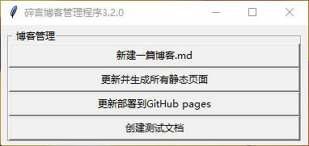
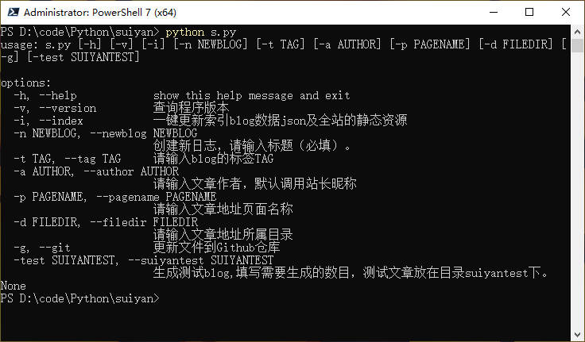

## suiyan 碎言静态博客

### 介绍

碎言这个名称取自与"碎言片语"，码兄累了吗？累了就休息一下，为未来的自己留下一些碎言片语吧。

演示(github)： [碎言博客](http:/suiyan.cc/)

### 软件架构

2023-07-29 更新版本 3.2.0 

删除了一些无用的配置和样式文件，更新窗口管理模式功能按钮

2023-03-24 新版 3.0.0 发布啦.

集成了jinja2的模板引擎，大大的提高了静态页面的构建速度， 支持模板主题的制作。

使用了asyncio和aiofiles模块来实现异步IO操作，提高了生成静态博客页面的效率，几百页面瞬间生成。

更新当前博客主题：使用了tailwind_HyperUI样式，免费开源Tailwind CSS组件。

构建博客索引并可以通过标题进行全站搜索。

博客文章写作采用Markdown技术支持，让你专注写作更流畅。

推荐使用Vscode搭配进行blog文章的编写(因为当创建新文章后会直接使用vscode直接打开)

如果新建blog文章无法在vscode中打开，请在命令面板中搜索shell，在PATH 中安装code命令。

### 安装教程

首先克隆下载碎言静态博客，
* [Gitee](https://gitee.com/J_Sky/suiyan)
* [GitHub](https://github.com/Jsky2020/suiyan)

终端运行:

    pip install -r requirements.txt

如果速度太慢请使用镜像：

    pip install -r requirements.txt -i https://pypi.tuna.tsinghua.edu.cn/simple/

安装相关依赖。需要Python版本3.8+之后的版本

博客的管理支持终端和图形界面：

图形界面：

    python3 w.py

终端启动命令：

    python s.py

可以根据自己的喜好进行选择。

### 目录结构

下边是一个完整的项目结构，有些目录需要创建md文件和生成静态文件后才会显示。

    ├── LICENSE 开源协议
    ├── README.md 说明文档
    ├── articles md文件存放目录（名称可以自定义）
    ├── blog 静态文件存放目录（名称可以自定义）
    ├── config.json 站点配置文件
    ├── logs 日志存放目录
    ├── requirements.txt 依赖文件
    ├── s.py 主程序和终端操作命令行
    ├── seo 这里存放着一些SEO文件，比如验证，robots.txt
    ├── theme 主题目录，下边的每一个目录对应一个主题，可以在配置文件里修改主题
    ├── utils.py 程序依赖的方法
    └── w.py 窗口操作的程序

### 首次运行

首次运行建议先修改根目录下的配置文件`config.json`,这里简单介绍一下配置项:

        {
        "dev": 0,
        "blog_name": "碎言",
        "blog_name_en": "SuiYan",
        "blog_author": "J.sky",
        "blog_description_en": "You see see you , This one day day di.",
        "blog_typed": [
            "积硅步以致千里",
            "积怠惰以致深渊",
            "只比你努力一点的人",
            "其实已经甩你很远了！"
        ],
        "meta_description": "记录并分享个人学习Python、blender的过程和笔记,定期分享原创壁纸。Life is short, You need blender and Python！",
        "meta_keywords":"壁纸,设计师,Blender,Python,JavaScript,程序员,人生苦短,我用Python",
        "profile_image":"assets/images/avatar.png",
        "blog_bg": "assets/images/bg.jpg",
        "theme": "tailwind_HyperUI",
        "build": "blog",
        "md_dir": "articles",
        "blog_page_num":12,
        "blog_test_url":"http://192.168.0.88:5500/",
        "blog_url":"https://suiyan.cc/",
        "blog_sns": [
            {
                "ico": "github",
                "url": "https://github.com/bosichong/suiyan"
            },
            {
                "ico": "gitee",
                "url": "https://gitee.com/J_Sky/suiyan"
            },
            {
                "ico": "mail",
                "url": "mailto:285911@gmail.com"
            },
            {
                "ico": "bili",
                "url": "https://space.bilibili.com/275991552"
            },
            {
                "ico": "rss",
                "url": "https://suiyan.cc/rss.xml"
            }
        ],
        "nav": [
            {
                "ico": "archive",
                "text": "归档",
                "url": "archives.html"
            },
            {
                "ico": "tags",
                "text": "标签",
                "url": "tags.html"
            }
        ],
        "links": [
            {
                "site_name": "小林笔记",
                "site_url": "https://m.senlinm.cn",
                "site_description": "轻生活，秒上签",
                "site_avatar": "https://senlinm.s3.us-east-005.backblazeb2.com/01.png"
            },
            {
                "site_name": "zhangpingcloud",
                "site_url": "https://www.zhangpingcloud.tech/",
                "site_description": "编程爱好者，帅哥一个。",
                "site_avatar": "http://suiyan.cc/assets/images/user_circle.png"
            },
            {
                "site_name": "特立独行的异类",
                "site_url": "https://www.demochen.com",
                "site_description": "一张肆无忌惮的脸，一颗桀骜不驯的心。",
                "site_avatar": "https://www.demochen.com/images/avatar.png"
            },
            {
                "site_name": "八咫乌",
                "site_url": "https://www.vergilisme.com/",
                "site_description": "思君如满月，夜夜减清辉",
                "site_avatar": "https://www.vergilisme.com/usr/themes/Lumieres/fonts/logo_vertical.svg"
            },
            {
                "site_name": "ScarSu - 终身成长,前端技术,信息源",
                "site_url": "https://www.scarsu.com",
                "site_description": "96女性程序员，以终身成长为人生意义，热爱前端技术，喜欢读各种书，关注效率提升、自我管理、心智成长、认知提升、极简生活。",
                "site_avatar": "https://scarsu.oss-cn-shanghai.aliyuncs.com/picgo20201012144739.jpg"
            },
            {
                "site_name": "BORBER",
                "site_url": "https://blog.borber.top/",
                "site_description": "跌宕歌词 纵横书卷 不与遣年华",
                "site_avatar": "https://cdn.jsdelivr.net/gh/Borber/PublicPic1/headImg/head.png"
            },
            {
                "site_name": "胡涂说",
                "site_url": "https://hutusi.com/",
                "site_description": "中文独立博客，任抛星汉归园圃，留取乾坤盛酒囊。",
                "site_avatar": "http://suiyan.cc/assets/images/user_circle.png"
            },
            {
                "site_name": "诺依阁的日常记录",
                "site_url": "https://blog.nuoyis.com/",
                "site_description": "更多好玩有趣的内容都在这里",
                "site_avatar": "https://blog.nuoyis.com/favicon.ico"
            },
            {
                "site_name": "图灵技术域",
                "site_url": "http://www.omegaxyz.com/",
                "site_description": "徐奕的专栏-机器学习、软件工程、计算机大佬。",
                "site_avatar": "https://www.omegaxyz.com/wp-content/uploads/2020/01/AI-GIF.gif"
            },
            {
                "site_name": "碎言",
                "site_url": "https://suiyan.cc",
                "site_description": "记录并分享个人学习Python、JavaScript的过程和笔记。Life is short, You need JavaScript and Python！",
                "site_avatar": "https://suiyan.cc/assets/images/avatar.jpg"
            }
        ]
        
    
    }

配置文件可以根据自己的需要添加删除，在jinja2 模板中使用`{{ 属性名称 }}`来调用。

修改完毕后就可以创建新文章了。

### 创建文章

    python s.py -n 此处写文章标题

注意！文章标题为必填！

这个时候就会在`articles`目录下创建一篇文章,并且使用`vscode`直接打开。

如果你没有安装`vscode`的命令行，需要安装后才会打开，但是文件会被创建

### 生成静态文件

    python s.py -i

生成全站静态文件，生成的静态文件会放在`blog`目录下。

### 发布到GitHub

    python s.py -g

发布到GitHub，将`blog`目录下的所有文件上传到GitHub仓库.

此功能需要自行配置GitHub的token，将GitHub站点的仓库与blog绑定，否则会上传失败。
若是此功能无效果，建议手动更新。

### 修改博客及站长资料

`config.json`里存放着一些站点的资料，上传前建议先修改成自己的资料。

### 运行站点

本地主题开发编写，推荐使用`Live Server`这个vscode得插件，非常方便。

在配置文件里修改：
"dev": 1,  # 调试模式，如果改为1，则使用"blog_test_url"来添加静态资源地址前缀，方便本地调试。

### 修改站点样式

采用jinja2模板引擎，在主题或是模板目录修改样式，一键生成页面，直接同步页面。
在jinja2 模板中使用`{{ 属性名称 }}`来调用。

使用其他主题，将主题复制到`theme`目录中，修改配置文件中的"theme": "主题目录",即可启用。

### 部署

    git push origin master

提交`blog`目录下所有文件到git仓库即可，`blog`就是所有博客的全部文件！

### github pages

如何部署GitHub pages 搭建自己的博客，这里就不在详细介绍了，请参考下文。

[GitHub Pages 快速入门](https://docs.github.com/zh/pages/quickstart)

除了部署GitHub，也可以将静态文件部署到虚拟主机云服务器上，复制静态文件目录下的所有文件到你的站点目录下即可。

